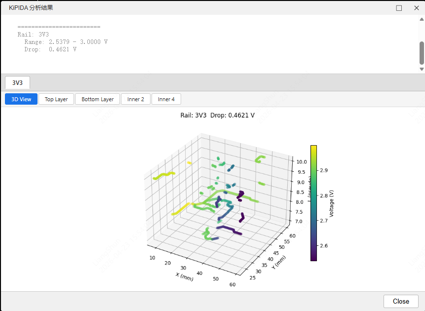
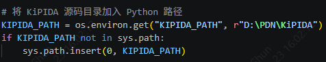

# KiPIDA 桥接插件

将 [KiPIDA](https://github.com/kbralten/KiPIDA) PDN IR Drop 分析工具桥接到嘉立创EDA专业版的扩展插件。

## 功能概述

- 从 EasyEDA 提取 PCB 走线、过孔、焊盘数据
- 在配置面板中选择电源网络、指定电压源与电流负载
- 调用本地 KiPIDA 求解器进行 IR Drop 分析
- 以 3D 热力图 + 各层 2D 热力图的形式展示分析结果

## 工作流程

### 1. 配置分析参数

打开 PCB 文件后，点击菜单 **PDN 分析 → 运行 IR Drop 分析**，弹出配置面板：


- 左侧自动检测 PCB 中的电源网络，点击选中目标网络
- 右侧为该网络添加 **SOURCE**（电压源器件）和 **LOAD**（负载器件）
- 设置额定电压、各负载电流值
- 调整底部的 **Mesh Resolution**（网格精度，越小越精确但越慢）

### 2. 查看分析结果

点击 **Run Simulation** 后，结果窗口自动弹出：



- 顶部文字摘要：每个 Rail 的电压范围和 IR Drop 值
- 标签页切换：3D View（全局三维热力图）+ 各铜层 2D 热力图
- 颜色映射：黄色 = 高电压，紫色 = 低电压（viridis 色阶）
- 分析图像同时保存到 `kipida-service/output/` 目录

---

## 安装与配置

### 前置依赖

| 依赖 | 说明 |
|------|------|
| 嘉立创EDA专业版 ≥ 2.3.0 | 插件运行环境 |
| Python 3.10+ | 运行 kipida-service |
| KiPIDA 源码 | 提供求解器核心 |

### 1. 安装 KiPIDA

从 [KiPIDA GitHub](https://github.com/kbralten/KiPIDA) 下载源码到本地，例如 `D:\PDN\KiPIDA`。

### 2. 配置 KiPIDA 路径

打开 `kipida-service/main.py`，修改第 14 行的默认路径：



```python
KIPIDA_PATH = os.environ.get("KIPIDA_PATH", r"D:\PDN\KiPIDA")
```

也可以通过环境变量覆盖，无需修改代码：

```bash
set KIPIDA_PATH=D:\你的路径\KiPIDA
```

### 3. 安装 Python 依赖

```bash
cd kipida-service
pip install -r requirements.txt
```

### 4. 启动 Python 服务

```bash
cd kipida-service
python -m uvicorn main:app --reload --port 5000
```

服务启动后访问 http://localhost:5000/docs 可查看 API 文档。

### 5. 安装 EasyEDA 插件

在嘉立创EDA专业版中：**高级 → 扩展管理器 → 导入扩展**，选择 `build/dist/kipida-bridge_v1.0.0.eext`。

---

## 项目结构

```
eext-kipida-integration/
├── src/                    # TypeScript 插件源码
│   ├── index.ts            # 主入口，菜单注册
│   ├── extract.ts          # PCB 数据提取
│   ├── convert.ts          # EasyEDA → KiPIDA 格式转换
│   ├── api.ts              # HTTP 客户端
│   ├── display.ts          # 结果展示
│   └── types.ts            # 类型定义
├── ui/
│   ├── config.html         # 配置面板
│   └── results.html        # 结果展示面板
├── kipida-service/
│   ├── main.py             # FastAPI 服务（调用 KiPIDA 求解器）
│   └── requirements.txt
├── build/dist/             # 编译产物（.eext 文件）
└── extension.json          # 插件配置
```

---

## 开发构建

```bash
npm install
npm run build
```

构建产物输出到 `build/dist/kipida-bridge_v1.0.0.eext`。

---

## 注意事项

- KiPIDA 源码**不需要修改**，插件仅调用其 `solver.py` 和 `mesh.py`
- Python 服务必须在运行分析前启动，默认端口 5000
- 服务地址可在插件菜单 **PDN 分析 → 配置服务地址** 中修改
- `mesh_resolution` 越小精度越高，但分析时间显著增加（推荐 0.2~0.5mm）
