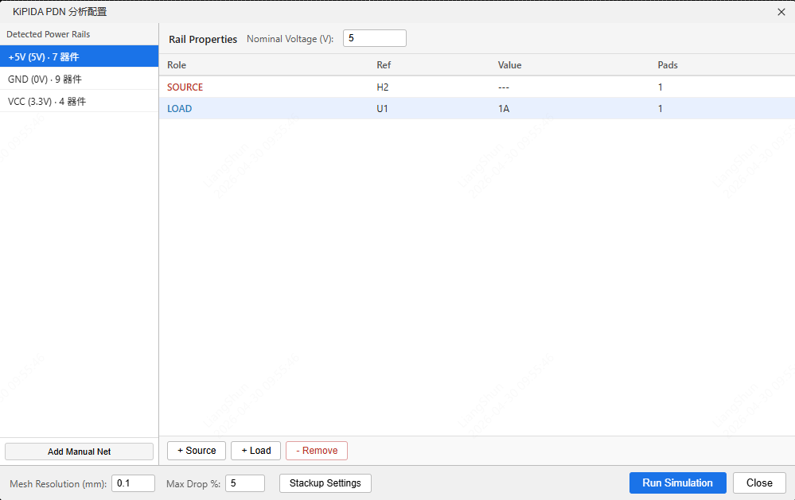
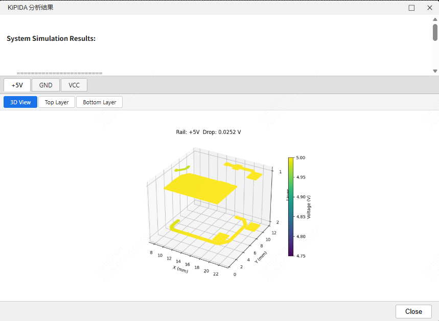

# KiPIDA Bridge Extension

A bridge extension that connects [KiPIDA](https://github.com/kbralten/KiPIDA) PDN IR Drop analysis tool to EasyEDA Professional.

**Repository**: [https://github.com/easyeda/eext-kipida-integration](https://github.com/easyeda/eext-kipida-integration)

## Features

- Extract PCB traces, vias, and pad data from EasyEDA
- Select power networks, specify voltage sources and current loads in the configuration panel
- Call local KiPIDA solver for IR Drop analysis
- Display analysis results as 3D heatmap + per-layer 2D heatmaps

## Workflow

### 1. Configure Analysis Parameters

After opening a PCB file, click menu **PDN Analysis → Run IR Drop Analysis** to open the configuration panel:



- Left panel automatically detects power networks in the PCB, click to select target network
- Right panel adds **SOURCE** (voltage source devices) and **LOAD** (load devices) for the selected network
- Set rated voltage and current values for each load
- Adjust **Mesh Resolution** at the bottom (smaller = more precise but slower)

### 2. View Analysis Results

After clicking **Run Simulation**, the results window pops up automatically:



- Top text summary: voltage range and IR Drop value for each Rail
- Tab switching: 3D View (global 3D heatmap) + per-copper-layer 2D heatmaps
- Color mapping: yellow = high voltage, purple = low voltage (viridis color scale
- Analysis images are also saved to `kipida-service/output/` directory

---

## Installation & Configuration

> This extension is distributed through EasyEDA Extension Store. Users can directly install the `.eext` plugin file. However, the plugin requires a local Python service to run. You need to download the `kipida-service` folder from the [GitHub repository](https://github.com/easyeda/eext-kipida-integration) and configure it.

### Prerequisites

| Dependency | Description |
|------------|-------------|
| EasyEDA Professional ≥ 2.3.0 | Plugin runtime environment |
| Python 3.10+ | Run kipida-service |

### 1. Get kipida-service

Download the `kipida-service` folder from the GitHub repository:

```bash
git clone https://github.com/easyeda/eext-kipida-integration.git
```

Only the `kipida-service/` directory is needed.

### 2. Start Python Service

Double-click `kipida-service/start.bat`. The script will automatically install dependencies and start the service.

You can also start manually:

```bash
cd kipida-service
pip install -r requirements.txt
python -m uvicorn main:app --reload --port 5000
```

After the service starts, visit http://localhost:5000/docs to view the API documentation.

### 3. Install EasyEDA Extension

In EasyEDA Professional: **Advanced → Extension Manager → Import Extension**, select `build/dist/kipida-bridge_v1.0.0.eext`.

You can also search and install directly through EasyEDA Extension Store.

---

## Project Structure

```
eext-kipida-integration/
├── src/                    # TypeScript extension source code
│   ├── index.ts            # Main entry, menu registration
│   ├── extract.ts          # PCB data extraction
│   ├── convert.ts          # EasyEDA → KiPIDA format conversion
│   ├── api.ts              # HTTP client
│   ├── display.ts          # Result display
│   └── types.ts            # Type definitions
├── ui/
│   ├── config.html         # Configuration panel
│   └── results.html        # Results display panel
├── kipida-service/
│   ├── main.py             # FastAPI service (calls KiPIDA solver)
│   └── requirements.txt
├── build/dist/             # Build output (.eext files)
└── extension.json          # Extension configuration
```

---

## Development & Build

```bash
npm install
npm run build
```

Build output goes to `build/dist/kipida-bridge_v1.0.0.eext`.

---

## Notes

- KiPIDA source code **does not need modification**. The extension only calls its `solver.py` and `mesh.py`
- Python service must be started before running analysis, default port is 5000
- Service address can be modified in extension menu **PDN Analysis → Configure Service Address**
- Smaller `mesh_resolution` means higher precision but significantly longer analysis time (recommended: 0.2~0.5mm)