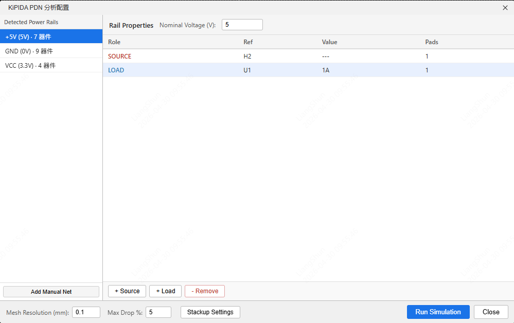
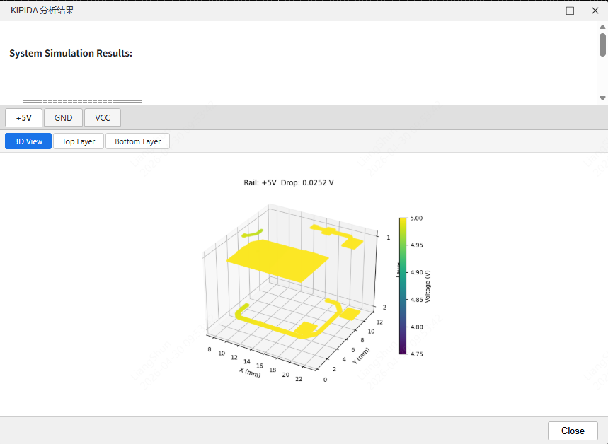

# KiPIDA Bridge Extension

A bridge extension that connects [KiPIDA](https://github.com/kbralten/KiPIDA) PDN IR Drop analysis tool to EasyEDA Professional.

**Repository**: [https://github.com/easyeda/eext-kipida-integration](https://github.com/easyeda/eext-kipida-integration)

## What is PDN Simulation?

### Terminology

| Abbreviation | Full Name | Description |
|--------------|-----------|-------------|
| PDN | Power Distribution Network | The complete power delivery path on a PCB from the power source to the IC, including power planes, traces, vias, decoupling capacitors, etc. |
| IR Drop | Voltage Drop (I×R) | The voltage loss caused by current (I) flowing through conductor resistance (R) |

### Why Do You Need PDN Simulation?

In PCB design, power travels from the VRM (Voltage Regulator Module) to chip pins through copper traces, vias, and pads. Although these conductors have very low resistance, when load currents are high, the accumulated voltage drop (IR Drop) can cause the actual supply voltage at the chip to fall below its minimum operating voltage — leading to logic errors, timing violations, or even failure to start.

PDN simulation meshes the PCB copper geometry and calculates the voltage distribution at each node, helping designers identify issues before fabrication:

- **Under-powered regions**: Which chip pins receive voltage below acceptable tolerance
- **Current bottlenecks**: Localized high current density caused by narrow traces or insufficient vias
- **Layout optimization guidance**: Where to place decoupling capacitors, which traces to widen, etc.

This extension integrates KiPIDA's PDN IR Drop solver into EasyEDA, allowing users to run simulations and view results directly within the PCB editor — no need to export files to third-party tools.

## Features

- Extract PCB traces, vias, and pad data from EasyEDA
- Select power networks, specify voltage sources and current loads in the configuration panel
- Call local KiPIDA solver for IR Drop analysis
- Display analysis results as 3D heatmap + per-layer 2D heatmaps

## Workflow

### 1. Configure Analysis Parameters

After opening a PCB file, click menu **PDN Analysis → Run IR Drop Analysis** to open the configuration panel:



- Left panel automatically detects power networks in the PCB, click to select target network
- Right panel adds **SOURCE** (voltage source devices) and **LOAD** (load devices) for the selected network
- Set rated voltage and current values for each load
- Adjust **Mesh Resolution** at the bottom (smaller = more precise but slower)

### 2. View Analysis Results

After clicking **Run Simulation**, the results window pops up automatically:



- Top text summary: voltage range and IR Drop value for each Rail
- Tab switching: 3D View (global 3D heatmap) + per-copper-layer 2D heatmaps
- Color mapping: yellow = high voltage, purple = low voltage (viridis color scale
- Analysis images are also saved to `kipida-service/output/` directory

---

## Installation & Configuration

> This extension is distributed through EasyEDA Extension Store. Users can directly install the `.eext` plugin file. However, the plugin requires a local Python service to run. You need to download the `kipida-service` folder from the [GitHub repository](https://github.com/easyeda/eext-kipida-integration) and configure it.

### Prerequisites

| Dependency | Description |
|------------|-------------|
| EasyEDA Professional ≥ 2.3.0 | Plugin runtime environment |
| Python 3.10+ | Run kipida-service |

### 1. Install EasyEDA Extension

In EasyEDA Professional: **Advanced → Extension Manager → Import Extension**, select `build/dist/kipida-bridge_v1.0.0.eext`.

You can also search and install directly through EasyEDA Extension Store.

### 2. Get kipida-service

Download the `kipida-service` folder from the GitHub repository:

```bash
git clone https://github.com/easyeda/eext-kipida-integration.git
```

Only the `kipida-service/` directory is needed.

### 3. Start Python Service

Double-click `kipida-service/start.bat`. The script will automatically:

1. Download KiPIDA core algorithm files (`mesh.py`, `solver.py`) from GitHub
2. Install Python dependencies (fastapi, numpy, scipy, etc.)
3. Start the service (default port 5000)

Internet connection is required for the first launch; subsequent launches can work offline.

To start manually:

```bash
cd kipida-service
pip install -r requirements.txt
python -m uvicorn main:app --reload --port 5000
```

After the service starts, visit http://localhost:5000/docs to view the API documentation.

---

## Project Structure

```
eext-kipida-integration/
├── src/                    # TypeScript extension source code
│   ├── index.ts            # Main entry, menu registration
│   ├── extract.ts          # PCB data extraction
│   ├── convert.ts          # EasyEDA → KiPIDA format conversion
│   ├── api.ts              # HTTP client
│   ├── display.ts          # Result display
│   └── types.ts            # Type definitions
├── ui/
│   ├── config.html         # Configuration panel
│   └── results.html        # Results display panel
├── kipida-service/
│   ├── main.py             # FastAPI service (calls KiPIDA solver)
│   ├── start.bat           # One-click startup script
│   └── requirements.txt
├── build/dist/             # Build output (.eext files)
└── extension.json          # Extension configuration
```

---

## Development & Build

```bash
npm install
npm run build
```

Build output goes to `build/dist/kipida-bridge_v1.0.0.eext`.

---

## Notes

- KiPIDA core algorithms (`mesh.py`, `solver.py`) are from [kbralten/KiPIDA](https://github.com/kbralten/KiPIDA) — automatically downloaded on first launch
- Use the `KIPIDA_PATH` environment variable to specify a custom KiPIDA location; `start.bat` defaults to `kipida-service/KiPIDA/`
- Python service must be started before running analysis, default port is 5000
- Service address can be modified in extension menu **PDN Analysis → Configure Service Address**
- Smaller `mesh_resolution` means higher precision but significantly longer analysis time (recommended: 0.2~0.5mm)

## Updating KiPIDA

Delete `kipida-service/KiPIDA/mesh.py` and `solver.py`, then re-run `start.bat` to download the latest versions. Or manually download from:

**Source**: [https://github.com/kbralten/KiPIDA](https://github.com/kbralten/KiPIDA)